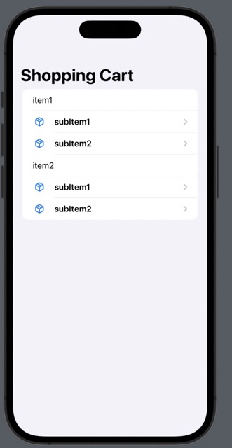

#  Displaying List of JSON Items with Sub-Lists
This project demonstrates how to display a nested loop of items for an iPhone app in SwiftUI. In other words it displays a list of items, where
each item has its own list of sub items. 

It was created in response to the following CWC+ question: https://codecrew.codewithchris.com/t/display-json-in-hierarchical-list-swiftui/22378

Note anyone looking to model difficult JSON structures, or looking to speed up their model creation should
use the excellent tool here: https://app.quicktype.io. Big thanks to Stewart Lynch's tutorial for mentioning this. 

# Design
## Items List
Note that sliding any item to the left will delete it from the screen.

## Sub Item View

